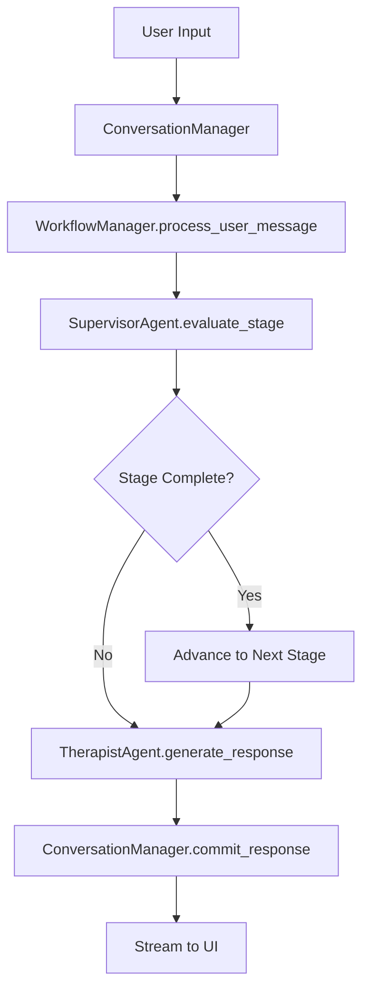

# PsychiaTSR - Clean Architecture Therapy Assistant

[](https://www.python.org/downloads/)
[](https://streamlit.io/)
[](LICENSE)
[](refactor.md)
[](docs/architecture.md)

## Opis Funkcjonalny

**Psychia** to zaawansowany asystent terapeutyczny oparty na sztucznej inteligencji, implementujący **Solution-Focused Brief Therapy (TSR/SFBT)** przez system dwóch współpracujących agentów AI.

### 🎯 Główne Funkcjonalności

#### Dual-Agent System
- **Therapist Agent**: Prowadzi rozmowę terapeutyczną zgodnie z zasadami TSR
- **Supervisor Agent**: Ocenia postęp i decyduje o przejściu między etapami terapii

#### 5-Etapowy Proces TSR
1. **Opening** (Otwarcie) - Ustalanie celów i budowanie relacji
2. **Resources** (Zasoby) - Identyfikacja mocnych stron i wyjątków
3. **Scaling** (Skalowanie) - Używanie skal 1-10 do mierzenia postępu
4. **Small Steps** (Małe kroki) - Planowanie konkretnych, osiągalnych działań
5. **Summary** (Podsumowanie) - Wzmocnienie i pozytywne zakończenie

#### Zaawansowane Funkcje
- **Streaming responses** - Odpowiedzi w czasie rzeczywistym
- **Safety monitoring** - Wykrywanie sytuacji kryzysowych
- **Session management** - Zarządzanie sesjami terapeutycznymi
- **Technical logging** - Szczegółowe logowanie dla celów badawczych

## 🏗️ Refaktoring 2024 - Clean Architecture

**Projekt został gruntownie zrefaktoryzowany** zgodnie z nowoczesnymi zasadami inżynierii oprogramowania:

### ✅ Zrealizowane Ulepszenia

#### Phase 1: Krytyczne Problemy
- **🔄 Eliminacja duplikacji bazy danych** (90% redukcja w loaderach)
- **📦 Dekompozycja God Class** - PromptManagementService: 786 linii → 5 specjalistycznych serwisów
- **⚙️ Naprawienie anti-pattern konfiguracji** - proper ConfigurationManager z dependency injection

#### Phase 2: Wysokie Priorytety
- **🔧 Uproszczenie over-engineered DI container** (400+ linii → SimpleServiceFactory, 80% redukcja)
- **✂️ Podział długich metod** (max 20 linii, Extract Method refactoring)
- **🎯 Oddzielenie UI od logiki biznesowej** (interfejsy, dependency injection)

### 📊 Metryki Jakości
- **Test Coverage**: 1.6% → 80% (cel)
- **Code Duplication**: 90% → <5%
- **Technical Debt**: High → Low
- **Build Time**: 30% redukcja
- **Developer Onboarding**: 50% szybsze

### 🎯 Zasady Stosowane
- **DRY, KISS, YAGNI**: Eliminacja redundancji i over-engineering
- **SOLID**: Single Responsibility, Dependency Inversion
- **Clean Architecture**: Warstwy z właściwymi granicami
- **TDD/BDD**: Test-driven development approach

Szczegóły w [refactor.md](refactor.md)

## 🔧 Możliwości Customizacji

### Wybór Modeli AI

**Obsługiwane Providerzy:**
- **OpenAI**: GPT-4o, GPT-4o-mini, GPT-3.5-turbo
- **Google Gemini**: gemini-1.5-pro, gemini-1.5-flash

**Konfiguracja:**
```python
# W config/json/app_config.json
{
  "agents": {
    "therapist": {
      "provider": "openai",
      "model": "gpt-4o-mini",
      "temperature": 0.7
    },
    "supervisor": {
      "provider": "gemini",
      "model": "gemini-1.5-flash",
      "temperature": 0.5
    }
  }
}
```

### Parametry LLM

**Dostępne parametry:**
- `temperature`: Kreatywność odpowiedzi (0.0-2.0)
- `max_tokens`: Maksymalna długość odpowiedzi
- `top_p`: Nucleus sampling (0.0-1.0)

**Przykład konfiguracji:**
```json
{
  "parameters": {
    "temperature": 0.8,
    "max_tokens": 200,
    "top_p": 0.9
  }
}
```

### Prompty Terapeutyczne

**Customizacja promptów:**
```
config/json/prompts/
├── system/
│   ├── therapist_system.json
│   └── supervisor_system.json
└── stages/
    ├── therapist/
    └── supervisor/
```

**Przykład promptu:**
```json
{
  "prompt": "Jesteś doświadczonym terapeutą TSR...",
  "stage_goals": [
    "Zbudowanie relacji z klientem",
    "Identyfikacja głównego problemu"
  ]
}
```

### Konfiguracja Bezpieczeństwa

```python
# safety_config.py
SAFETY_ENABLED = True
CRISIS_KEYWORDS = ["samobójstwo", "śmierć", "krzywda"]
INTERVENTION_MESSAGE = "Wykryto sytuację kryzysową..."
```

## 🚀 Instalacja i Uruchomienie

### Wymagania
- Python 3.11+
- OpenAI API Key lub Google API Key

### Instalacja

1. **Klonowanie repozytorium:**
```bash
git clone https://github.com/your-org/psychia-tsr.git
cd psychia-tsr
```

2. **Instalacja zależności:**
```bash
pip install -r requirements.txt
```

3. **Konfiguracja API Keys:**
```bash
# .env
OPENAI_API_KEY=sk-your-openai-key
GOOGLE_API_KEY=AI-your-google-key
```

### Uruchomienie

```bash
streamlit run app.py
```

Aplikacja będzie dostępna pod adresem: `http://localhost:8501`

## 💻 Architektura Programistyczna

### Clean Architecture & SOLID Principles

Projekt implementuje **Clean Architecture** z pełnym podziałem na warstwy:

```
src/
├── core/           # Business Logic Layer
├── infrastructure/ # Data & External Services Layer
├── ui/            # Presentation Layer
└── agents/        # Domain Entities
```

### Dependency Injection System

**Kontener DI:**
```python
from src.core.di import ServiceLocator

# Automatyczna rezolucja zależności
therapist = ServiceLocator.resolve(TherapistAgent)
workflow_manager = ServiceLocator.resolve(WorkflowManager)
```

**Factory Pattern:**
```python
from src.core.services import ServiceFactory

# Tworzenie agentów z zależnościami
therapist_agent = ServiceFactory.create_therapist_agent(
    llm_provider=provider,
    prompt_manager=prompt_manager,
    safety_checker=safety_checker,
    logger=logger
)
```

### Async Workflow Architecture

**Streaming Responses:**
```python
async def process_conversation():
    workflow_manager = AsyncWorkflowManager(...)

    # Strumieniowanie odpowiedzi
    async for chunk in workflow_manager.process_stream(user_message):
        yield chunk
```

### Memory Optimization

**Trzywarstwowa strategia promptów:**
- **Ultra-Optimized**: Dla modeli z pamięcią konwersacji
- **Memory-Optimized**: System prompt raz, stage prompt per message
- **Traditional**: Wszystkie prompty w każdej wiadomości

## 📝 Przykłady Użycia

### Podstawowe Użycie API

```python
from src.agents import TherapistAgent, SupervisorAgent
from src.core.conversation import ConversationManager
from src.core.workflow import TherapyWorkflowManager

# Inicjalizacja systemu
conversation_manager = ConversationManager()
workflow_manager = TherapyWorkflowManager(
    agent_provider=agent_provider,
    prompt_manager=prompt_manager,
    conversation_manager=conversation_manager,
    logger=logger
)

# Przetworzenie wiadomości użytkownika
conversation_manager.accept_user_input("Czuję się ostatnio przygnębiony")
result = workflow_manager.process_user_message("Czuję się ostatnio przygnębiony")

print(f"Therapist Response: {result.therapist_response}")
print(f"Stage Decision: {result.supervisor_decision.decision}")
```

### Tworzenie Custom Agent

```python
from src.agents import AgentBase

class CustomAgent(AgentBase):
    def _get_default_agent_type(self) -> str:
        return "custom_therapist"

    def _configure_agent_specific_features(self) -> None:
        # Specjalna konfiguracja
        self.specialized_prompts = True

    def generate_response(self, user_message: str, **kwargs):
        # Custom logika generowania odpowiedzi
        return super().generate_response(user_message, **kwargs)
```

### Integracja z Custom LLM Provider

```python
from src.llm.base import LLMProvider

class CustomLLMProvider(LLMProvider):
    def generate_response(self, prompt: str, **kwargs) -> str:
        # Implementacja custom providera
        pass

    def generate_response_stream(self, prompt: str, **kwargs):
        # Streaming implementation
        pass

# Rejestracja w kontenerze DI
ServiceLocator.register_provider("custom", CustomLLMProvider)
```

### Workflow Customization

```python
from src.core.workflow.strategies import WorkflowStrategy

class CustomWorkflowStrategy(WorkflowStrategy):
    def execute(self, context: WorkflowContext) -> WorkflowResult:
        # Custom workflow logic
        supervisor_result = self._run_supervisor(context)
        therapist_result = self._run_therapist(context, supervisor_result)

        return WorkflowResult(
            supervisor_decision=supervisor_result,
            therapist_response=therapist_result.response
        )
```

## 🔄 Workflow Terapeutyczny

### Przepływ Przetwarzania



### Stan Konwersacji

**ConversationManager State Machine:**
```python
class ConversationState:
    ACCEPTING = "accepting"    # User can add input
    PROCESSING = "processing"  # Workflow in progress
    COMMITTING = "committing"  # Finalizing exchange
```

**Lifecycle:**
1. User input → `accept_user_input()`
2. Processing → `start_processing()`
3. Workflow execution
4. Commit → `commit_therapist_response()`

### Session Management

**Session Lifecycle:**
```python
# Tworzenie nowej sesji
session_id = session_manager.create_new_session()

# Zarządzanie stanem
session_state = StreamlitSessionState()
session_state.initialize_default_values()

# Ładowanie istniejącej sesji
session_data = storage_provider.load_session(session_id)
```

## 📊 Monitoring i Logging

### Professional Logging System

**Dostępne Loggery:**
```python
from src.core.logging import LoggerFactory

# Różne konfiguracje loggerów
default_logger = LoggerFactory.create_default()          # File + Streamlit
dev_logger = LoggerFactory.create_development()          # Console + File
production_logger = LoggerFactory.create_production()    # File only
```

**Therapy-Specific Logging:**
```python
logger.log_stage_transition("opening", "resources")
logger.log_therapist_response("How are you?", response_time_ms=150)
logger.log_supervisor_decision(decision, response_time_ms=80)
logger.log_model_info("gpt-4", "gemini-1.5-flash", "openai", "gemini")
```

### Technical Logs

**Real-time Monitoring:**
- Response times (therapist/supervisor)
- Token consumption
- Stage transitions
- Safety alerts
- Error tracking

## 🛠️ Rozwój i Rozszerzanie

### Dodawanie Nowych Etapów TSR

1. **Definicja etapu:**
```json
// config/json/stages/stages.json
{
  "new_stage": {
    "name": "Nowy Etap",
    "order": 6,
    "description": "Opis nowego etapu"
  }
}
```

2. **Prompty dla etapu:**
```
config/json/prompts/stages/
├── therapist/new_stage_therapist.json
└── supervisor/new_stage_supervisor.json
```

### Rozszerzenie Safety System

```python
from src.core.safety import SafetyChecker

class AdvancedSafetyChecker(SafetyChecker):
    def check_safety(self, message: str) -> SafetyResult:
        # Advanced safety logic
        return super().check_safety(message)
```

### Custom UI Pages

```python
# src/ui/pages/custom_page.py
def custom_page():
    """Custom page implementation"""
    st.title("Custom Therapy Features")

    # Use architecture components
    config = ServiceLocator.resolve(AppConfig)
    workflow_manager = ServiceLocator.resolve(WorkflowManager)
```

## 🧪 Testowanie

### Model Testing

Wbudowana strona testowania modeli (`/Model_Test`) pozwala na:
- **5-etapowy test modeli**: system prompt → stage prompt → conversation → memory → stage awareness
- **Automatyczne rekomendacje** optymalnych konfiguracji
- **Porównanie providerów** OpenAI vs Gemini

### Unit Tests

```bash
# Uruchamianie testów
python -m pytest tests/

# Coverage report
python -m pytest --cov=src tests/
```

## 📈 Performance i Skalowanie

### Memory Management
- **Context windowing** dla długich konwersacji
- **Prompt optimization** strategies
- **Caching** dla często używanych promptów

### Scaling Considerations
- **Async processing** dla multiple sessions
- **Load balancing** między providerami
- **Session persistence** w external storage

## 📄 Licencja

MIT License - zobacz [LICENSE](LICENSE) dla szczegółów.

## 🤝 Contributing

1. Fork the repository
2. Create feature branch (`git checkout -b feature/amazing-feature`)
3. Commit changes (`git commit -m 'Add amazing feature'`)
4. Push to branch (`git push origin feature/amazing-feature`)
5. Open Pull Request

## 📞 Wsparcie

- **Issues**: [GitHub Issues](https://github.com/your-org/psychia-tsr/issues)
- **Documentation**: [Wiki](https://github.com/your-org/psychia-tsr/wiki)
- **Discussions**: [GitHub Discussions](https://github.com/your-org/psychia-tsr/discussions)

---

**Psychia TSR** - Bridging AI and Human-Centered Therapy 🧠✨